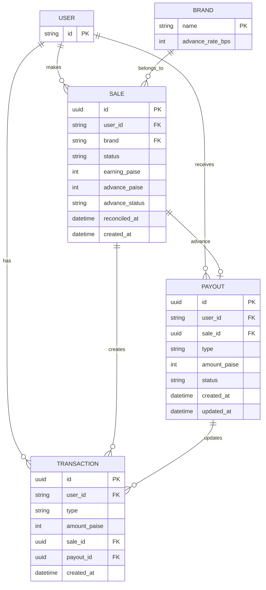

# Database Design

This document explains the database structure used in the project.

The application uses **SQLite** as the database. All money is stored in **paise**, and application generated IDs use **UUIDs**.

---

# Database Overview

The system contains five main tables:
* Users
* Brands
* Sales
* Payouts
* Transactions

---

# ER Diagram



---

# Tables

## Users
Stores all registered users (`id`).

## Brands
Stores brand names and their advance rates (`advance_rate_bps`).

## Sales
Stores affiliate sales (`user_id`, `brand`, `status`, `earning_paise`, `advance_paise`, `advance_status`, `reconciled_at`, `created_at`).

## Payouts
Stores advance payouts and user withdrawals (`user_id`, `sale_id`, `type`, `amount_paise`, `status`, `created_at`, `updated_at`).

## Transactions
Stores immutable balance updates (`user_id`, `type`, `amount_paise`, `sale_id`, `payout_id`, `created_at`).

---

# Balance Calculation

The user's balance is calculated from the transaction table:

```sql
SELECT COALESCE(SUM(amount_paise), 0)
FROM transactions
WHERE user_id = ?;
```

The application does not store a separate balance column.
