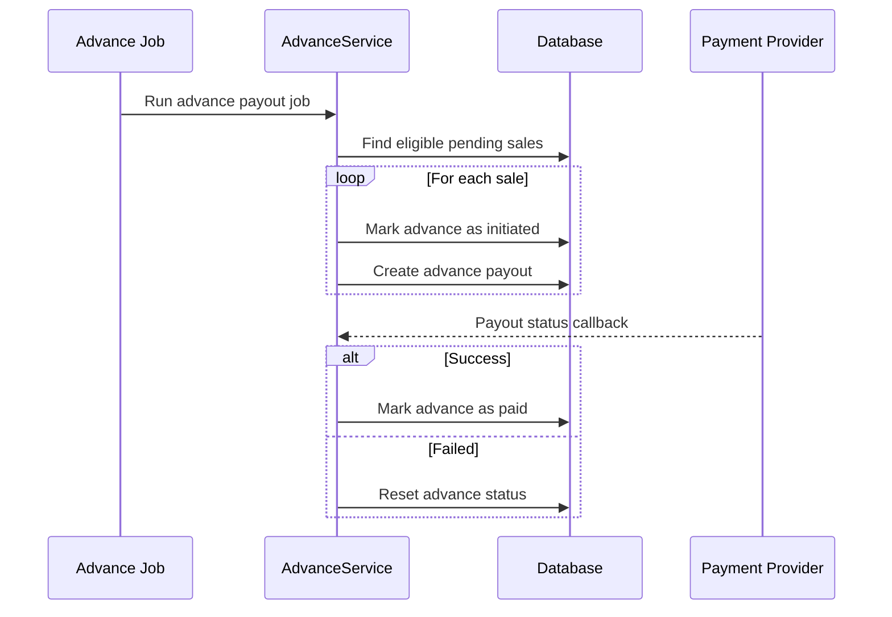
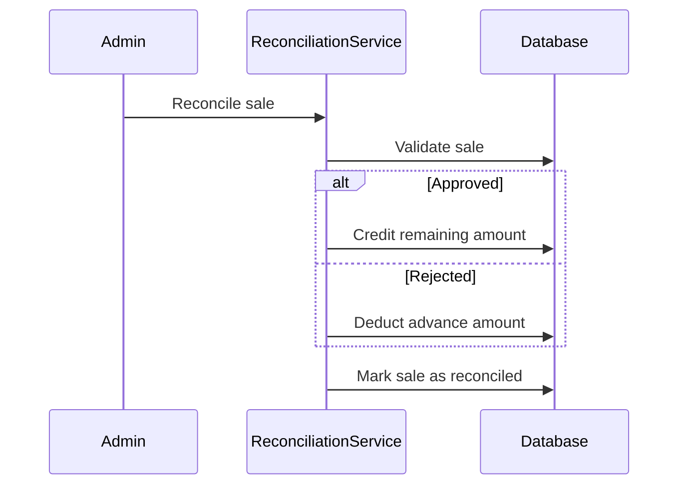
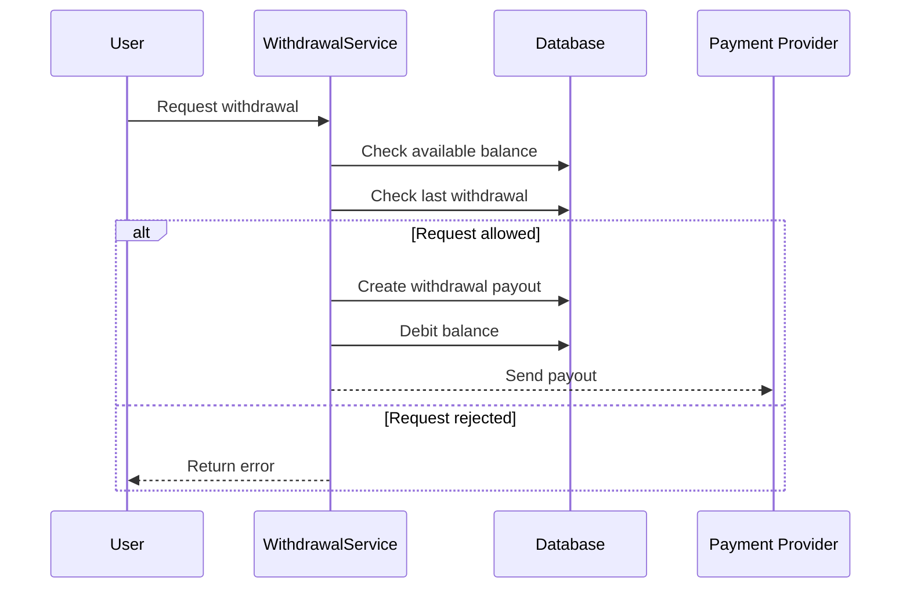
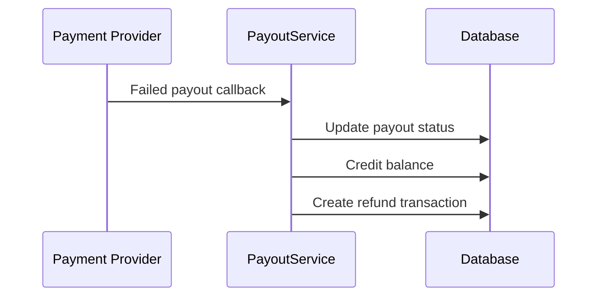

# Workflows

This document explains the main workflows of the system.

---

# 1. Advance Payout

The advance payout job checks all eligible pending sales and creates advance payouts.

---

# 2. Sale Reconciliation

An admin reviews every sale and marks it as Approved or Rejected.

---

# 3. Withdrawal

Users can withdraw their available balance once every 24 hours.

---

# 4. Failed Payout Recovery

If a withdrawal fails, the money is returned to the user's balance.

